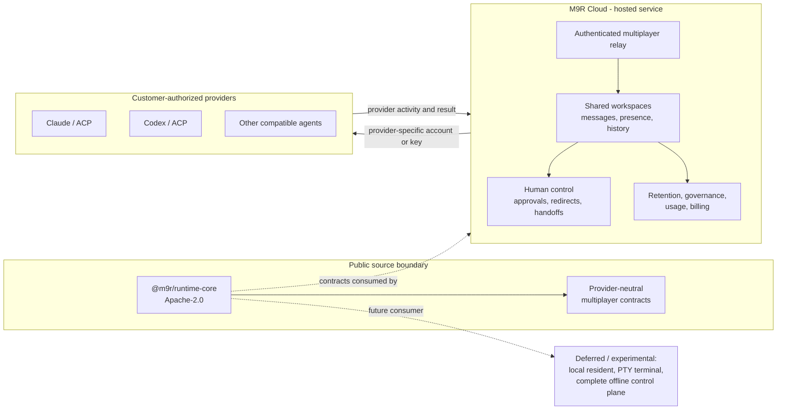

# M9R open-core architecture

Status: announcement-ready engineering diagram, 2026-09-10.

This document explains the first public boundary without claiming that the
experimental terminal or resident runtime is production-ready.

## What is public

The first independently buildable public package is `@m9r/runtime-core`.
It contains provider-neutral coordination, Goal, Context Packet, Completion
Receipt, and adapter-contract validation. It has no hosted credentials,
dashboard, Supabase, Stripe, provider account, or retained workspace data.

The wider repository is source-available under the root BUSL-1.1 license. Its
public documentation describes the multiplayer protocol and the boundary
between local contracts and M9R Cloud. Source availability does not grant the
right to operate M9R Cloud or use M9R marks; see the trademark policy.

## What M9R Cloud operates

M9R Cloud is the managed multiplayer layer: authenticated workspace relay,
shared conversations, live presence, human redirects and approvals, retained
history, governance, usage controls, billing, and provider-specific routing.
Provider execution remains subject to the connected provider's account,
region, billing mode, data policy, and terms. M9R does not pool customer
credentials or turn an ambiguous acknowledgment into provider proof.

## What this diagram does not promise

The initial announcement does not claim a production terminal, Mosaic-level
terminal persistence, clean-machine local runtime installation, or complete
offline operation. Those require separate cross-platform runtime evidence and
remain deferred until verified on the exact build being advertised.

## Related release documents

- [`OPEN_CORE.md`](../OPEN_CORE.md) — license and product boundary.
- [`OPEN_CORE_LAUNCH_PLAN.md`](../OPEN_CORE_LAUNCH_PLAN.md) — launch gates and
  announcement language.
- [`OPEN_CORE_ANNOUNCEMENT.md`](../OPEN_CORE_ANNOUNCEMENT.md) — public draft.
- [`packages/runtime-core/BOUNDARY.md`](../packages/runtime-core/BOUNDARY.md) —
  package-level inclusion and exclusion list.
- [`TRADEMARK_POLICY.md`](../TRADEMARK_POLICY.md) — reserved marks and fork
  naming rules.
